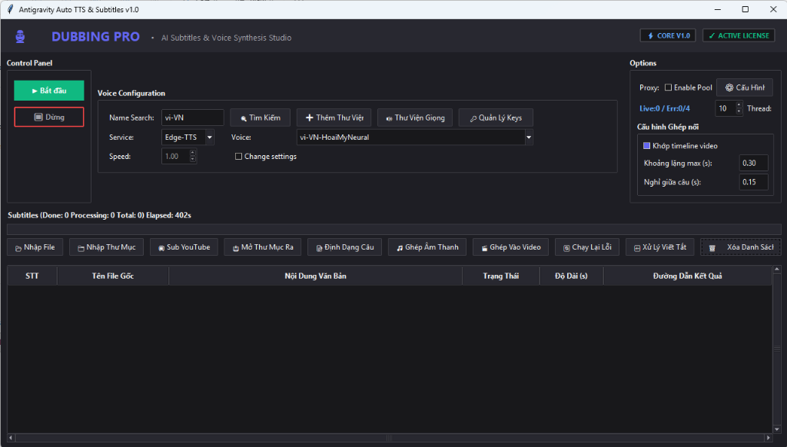

# AI Subtitles & Voice Synthesis Studio (Dubbing Pro) 🗣️📺

🔗 **Trang chủ / Homepage**: [https://than0mua-chat.github.io/dubbing-pro/](https://than0mua-chat.github.io/dubbing-pro/)

Bộ công cụ Desktop Studio chuyên nghiệp phục vụ thuyết minh tự động (Dubbing), tải phụ đề YouTube chất lượng cao, chuyển đổi văn bản thành giọng nói (TTS) tốc độ cao và tự động hóa quy trình mux video, hoạt động 100% độc lập không cần máy chủ API nền.

A professional desktop software suite designed for automatic video dubbing, YouTube subtitle downloading, high-speed text-to-speech (TTS) synthesis, and automated video muxing, running 100% standalone without any background API server.

---

## 📸 Giao diện ứng dụng / Product Interface



---

[**[English Version below]**](#english-version)

---

# BẢN TIẾNG VIỆT (VIETNAMESE VERSION)

## 📺 Giới thiệu chung
**Dubbing Pro** là giải pháp All-in-One chạy trực tiếp trên máy tính Windows. Phần mềm giúp các nhà sáng tạo nội dung, dịch giả, và biên tập viên tối ưu hóa toàn bộ luồng công việc: từ việc trích xuất phụ đề YouTube, dịch thuật, chuẩn hóa dấu câu bằng AI, cho đến việc tổng hợp giọng nói khớp thời gian (timeline-aligned TTS) và ghép trực tiếp vào video gốc bằng FFmpeg.

---

## ✨ Các tính năng cốt lõi

### 1. 📥 Tải phụ đề YouTube thông minh
*   **Trích xuất Video ID đa năng**: Tự động nhận diện và trích xuất ID từ mọi cấu trúc URL YouTube (watch, shorts, embed, share).
*   **Proxy Pool chống chặn IP**: Hỗ trợ nạp và quản lý danh sách proxy (HTTP/SOCKS) để vượt qua cơ chế giới hạn tần suất (rate limits) của YouTube khi tải phụ đề hàng loạt.
*   **Dịch thuật theo lô (High-Fidelity Google Translate)**: Tải bản dịch phụ đề gốc rồi tự động chia nhỏ dưới 3000 ký tự để gửi dịch qua Google Translate. Giải quyết triệt để lỗi dịch thiếu hoặc trộn lẫn ngôn ngữ của YouTube.

### 2. 📝 Định dạng & Tái cấu trúc ranh giới câu (Hybrid Mode)
Hỗ trợ hai chế độ thông minh để gộp các dòng phụ đề rời rạc thành các câu hoàn chỉnh:
*   **Thuật toán Heuristic Cục bộ (Offline)**: Xử lý cục bộ tốc độ cao, ngăn chặn lỗi ngắt câu sai ở các liên từ/từ hạn định cuối dòng (`và`, `nhưng`, `mọi`, `hoặc`, `with`, `and`, `or`) nếu dòng tiếp theo bắt đầu bằng chữ thường.
*   **Định dạng bằng Gemini AI (Mạng đám mây)**:
    *   **Phân đoạn request (Chunking)**: Tự động chia nhỏ phụ đề thành các lô 100 dòng để gửi yêu cầu API, giúp bảo vệ hạn mức TPM (Tokens Per Minute) và không bị mất ngữ cảnh.
    *   **Luân chuyển Model thông minh (Model-Rotation Pool)**: Ưu tiên sử dụng model **Gemini 2.5 Flash Lite** (hạn mức cao 10 RPM) và tự động xoay vòng sang `gemini-2.0-flash`, `gemini-3.1-flash-lite`, `gemini-2.5-flash`, `gemini-flash-latest` khi gặp lỗi quá tải `429 Rate Limit`.
    *   **Cooldown tự động**: Tự động nghỉ 12 giây khi toàn bộ bể model đều bận và trễ 2 giây giữa các request để bảo vệ khóa API.
    *   **Khôi phục ngữ pháp**: Tự động thêm dấu câu (`.`, `,`, `?`, `!`), viết hoa chữ cái đầu và sửa các lỗi viết tắt chuyên ngành (ví dụ: IT -> ai-ti, CISSP -> xi-ai-ét-ét-pi).

### 3. ⏱️ Nội suy thời gian & Chống lệch tiếng (Linear Time Interpolation)
*   **Nội suy cấp ký tự**: Sử dụng thuật toán so khớp chuỗi `SequenceMatcher` để ánh xạ mốc thời gian của từng ký tự từ phụ đề gốc sang phụ đề mới đã thêm dấu câu. Đảm bảo âm thanh phát ra luôn khớp tuyệt đối thời lượng của video, không bị hiện tượng lệch tiếng (drift) theo thời gian.
*   **Tự động ngắt câu dài**: Bất kỳ câu phục hồi nào dài quá 80 ký tự sẽ được tự động chia nhỏ tại các dấu phẩy `,` hoặc liên từ để tránh phụ đề tràn màn hình.

### 4. 🗣️ Thuyết minh giọng nói khớp dòng thời gian (TTS)
*   **Nghe thử trực tiếp**: Hỗ trợ nghe thử giọng đọc trực tiếp trên GUI mà không cần chạy máy chủ.
*   **Bể khóa ElevenLabs Key Pool**: Cho phép nạp hàng loạt ElevenLabs API Keys vào pool để luân phiên sử dụng, tự động bỏ qua key hết hạn mức.
*   **Khoảng nghỉ thở tự nhiên (Context-Aware Pauses)**: Tự động chèn khoảng lặng ngắn (0.15s) cho dấu phẩy và khoảng lặng dài (0.3s) cho dấu chấm câu.
*   **Bù khoảng lặng ở cuối (End-Silence Padding)**: Tự động tính toán chênh lệch thời lượng và chèn khoảng lặng ở cuối file âm thanh tương ứng để khớp 100% thời gian chạy của phụ đề gốc trong video.

### 5. 🎬 Ghép âm thanh & Phụ đề vào Video gốc
*   Mux (ghép) luồng âm thanh đã thuyết minh căn chỉnh thời gian và tệp phụ đề `.srt` trực tiếp vào video gốc bằng công cụ FFmpeg tích hợp trên máy chỉ với 1 cú click chuột.

---

## 🚀 Hướng dẫn sử dụng & Khởi chạy ứng dụng

### 1. Cấu hình môi trường (.env)
Tạo file `.env` ở thư mục gốc (hoặc sửa đổi từ file `.env.example`) và điền các tham số cấu hình:
```env
# Gemini API Key dùng cho tính năng định dạng câu bằng AI
GEMINI_API_KEY=your_gemini_api_key_here

# Giọng đọc mặc định của Edge-TTS
DEFAULT_VOICE=vi-VN-HoaiMyNeural
DEFAULT_SPEED=1.0
DEFAULT_LANGUAGE=vi-VN
```

### 2. Cài đặt các thư viện phụ thuộc
Yêu cầu Python 3.8+ và đã cài đặt FFmpeg trên hệ thống. Chạy lệnh cài đặt:
```bash
pip install -r requirements.txt
```

### 3. Chạy ứng dụng
*   **Cách 1**: Kích đúp vào tệp **`run_app.bat`** trên Windows.
*   **Cách 2**: Chạy lệnh trực tiếp từ Terminal:
    ```bash
    python app_gui.py
    ```

---

## 📦 Hướng dẫn đóng gói ứng dụng độc lập (Deploy Standalone)
Để đóng gói toàn bộ dự án thành một file `.exe` chạy độc lập duy nhất trên máy Windows (không yêu cầu cài đặt Python hay thư viện):
1.  Kích đúp chạy tệp **`build_exe.bat`**.
2.  Sau khi hoàn thành, ứng dụng standalone sẽ nằm trong thư mục **`dist\DubbingPro`**.
3.  Kích hoạt ứng dụng qua tệp **`dist\DubbingPro\DubbingPro.exe`**.

---

# ENGLISH VERSION

## 📺 Overview
**Dubbing Pro** is an All-in-One desktop workflow studio running natively on Windows. The software streamlines the entire video dubbing pipeline for content creators, translators, and editors: from downloading and auto-translating YouTube subtitles to punctuation restoration via LLMs, timeline-aligned TTS generation, and final video-audio muxing via FFmpeg.

---

## ✨ Key Features

### 1. 📥 Smart YouTube Subtitle Downloader
*   **Flexible Video ID Parser**: Automatically detects and extracts ID tokens from watch link, shorts, embeds, and shares.
*   **Anti-Block Proxy Pool**: Supports configuring proxy lists (HTTP/SOCKS) to bypass YouTube rate limiting blocks during batch tasks.
*   **High-Fidelity Google Translate**: Downloads the original clean subtitle track and translates it in chunks under 3000 characters via Google Translate, bypassing YouTube's buggy default translator.

### 2. 📝 Sentence Restructuring Pipeline (Hybrid Mode)
Restructure fragmented subtitles into complete sentences using one of two methods:
*   **Local Heuristic Mode (Offline)**: High-speed local processor preventing incorrect sentence splits at trailing conjunctions or determiners (`và`, `nhưng`, `mọi`, `with`, `and`, `or`) when the next line starts with a lowercase letter.
*   **Gemini AI Restructuring (Cloud Mode)**:
    *   **Chunked Requests**: Splits the subtitle lines into batches of 100 to protect TPM (Tokens Per Minute) and retain context.
    *   **Model-Rotation Pool**: Prioritizes **Gemini 2.5 Flash Lite** (10 RPM quota) and automatically rotates through `gemini-2.0-flash`, `gemini-3.1-flash-lite`, `gemini-2.5-flash`, and `gemini-flash-latest` when encountering `429 Rate Limit` errors.
    *   **Auto-Cooldown**: Sleeps for 12 seconds if all models in the pool are rate-limited, and delays requests by 2 seconds to ensure robust performance.
    *   **Grammar Restoration**: Automatically restores casing, adds punctuation (`.`, `,`, `?`, `!`), and standardizes acronym pronunciation based on context (e.g., IT -> ai-ti).

### 3. ⏱️ Character-level Time Interpolation
*   **Drift Prevention**: Matches original characters and updated punctuated characters using Python's `SequenceMatcher` to linearly interpolate timestamps down to the character level. Synthesized audio matches original sentence timelines 100%, preventing audio-video drift.
*   **Automatic Subdivision**: Any sentence exceeding 80 characters is split at natural comma or conjunction marks to prevent on-screen subtitle overflow.

### 4. 🗣️ Timeline-Aligned Text-to-Speech (TTS)
*   **Direct Audio Preview**: Allows playing voice previews directly from the GUI without needing a background server running.
*   **ElevenLabs Key Pool**: Supports loading multiple ElevenLabs API keys to rotate automatically, bypassing exhausted keys.
*   **Context-Aware Breathing Pauses**: Automatically injects short silence blocks (0.15s) for commas and longer blocks (0.3s) for sentence enders.
*   **End-Silence Padding**: Computes duration differences and appends trailing silence to generated audio clips to match the exact subtitle timeline on the video.

### 5. 🎬 FFmpeg Video Muxer
*   Muxes the final time-aligned audio track and the generated `.srt` subtitle file directly back into the original video with a single click.

---

## 🚀 Getting Started & Execution

### 1. Configure Environment (.env)
Create a `.env` file in the root folder (or copy from `.env.example`) and fill in your parameters:
```env
# Gemini API Key used for AI sentence restructuring
GEMINI_API_KEY=your_gemini_api_key_here

# Default Edge-TTS settings
DEFAULT_VOICE=vi-VN-HoaiMyNeural
DEFAULT_SPEED=1.0
DEFAULT_LANGUAGE=vi-VN
```

### 2. Install Dependencies
Requires Python 3.8+ and FFmpeg installed on your system. Run:
```bash
pip install -r requirements.txt
```

### 3. Launch the App
*   **Method 1**: Double-click **`run_app.bat`** on Windows.
*   **Method 2**: Run via terminal command:
    ```bash
    python app_gui.py
    ```

---

## 📦 Standalone App Packaging (Deploy Standalone)
To package the entire project into a single executable `.exe` file on Windows (no Python installation required for end-users):
1.  Double-click **`build_exe.bat`**.
2.  Once finished, the standalone suite will be created in **`dist\DubbingPro`**.
3.  Launch the app via **`dist\DubbingPro\DubbingPro.exe`**.

---

## 🤝 License

This project is licensed under the **GNU General Public License v3.0 (GPL-3.0)**.
